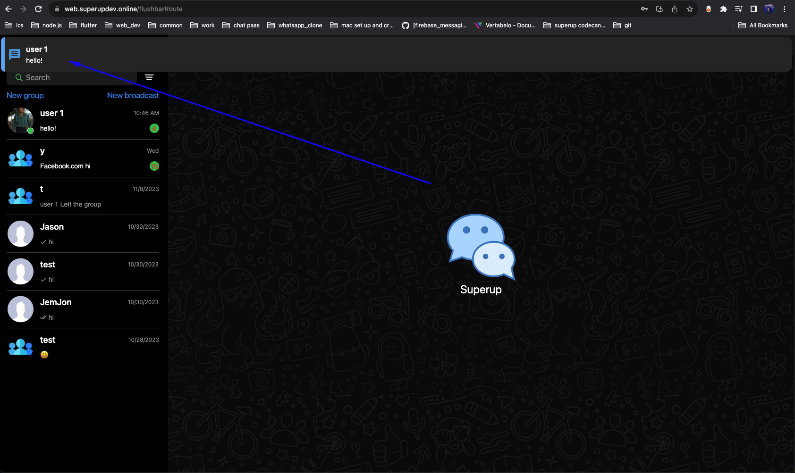

# Community FAQ

### How Users Register

- Users can register only by their `Email` and `password`
- Data collected from user while register is `Device Data` User location from his ip
- `Email` `Password` `Name` is required while user registers `bio`,`image` is Optional
- Users can Reset their password by sending Email OTP
- Data collected from user while register is `Device Data` User location from his ip
- `Email` `Password` `Name` is required while user registers `bio`,`image` is Optional
- Users can Reset their password by sending Email OTP

### New features

- I have built this app to be suitable for most of all users as I can
- So sure there are some features you will need it for your business this you can [contact me](./support.md) to
- See more details about your custom features

### Phone Login

- As this is whatsapp clone but i use the Email and password for login because
- I see this will be `suitable` for all users since I dont need to depends on firebase for `Auth`!

### Window,web notifications

- There is no Flutter package until now support native notifications in the web,window
- So i use in app notifications for web and windows I will improve it in the next release (add sound)
  

### Why not to use webRTC for calls

- I have already tried to add webRTC and already works, but I found the following
- it needs a very expensive VPS server and needs to make it scalable and distribute it as CDN for each country
- To get the most good video and voice quality, and it needs a lot of configurations since there
- Are pre-configured service like agora.io with a good price, and it has 1K minutes free for each month
- And it is more stable and scalable with a high quality, So I switch to it!


### Admin panel

- Admin panel in the first version it need more work in next updates sure i will add more user management stay tuned!

### Desktop Voice recorder

- Since there is no flutter package support Desktop voice reorder i have disabled it for now next updates i will make it
  works

### Bug while releasing android (Your project requires a newer version of kotlin)

- This bug isn't related to the kotlin (^_^)
- You need to configure the android for release generate
- In the android folder create `key.properties` and fill it out with the data of your `jks` key
- Create your `jks`

```
storePassword=your storePassword
keyPassword=your keyPassword
keyAlias=your keyAlias
storeFile=/Users/hatemragap/super-up-keystore.jks
```

- if you dont use the `jks` and not publish to google play you can simply do the following
- open `android/app/build.gradle`
- Replace the  [following](https://docs.flutter.dev/deployment/android#create-an-upload-keystore)

```
    signingConfigs {
        release {
            keyAlias keystoreProperties['keyAlias']
            keyPassword keystoreProperties['keyPassword']
            storeFile keystoreProperties['storeFile'] ? file(keystoreProperties['storeFile']) : null
            storePassword keystoreProperties['storePassword']
        }
    }
    buildTypes {
        release {
            signingConfig signingConfigs.release
        }
    }
```

to Delete the `signingConfigs{}`

```
  buildTypes {
        release {
            // TODO: Add your own signing config for the release build.
            // Signing with the debug keys for now, so `flutter run --release` works.
            signingConfig signingConfigs.debug
        }
    }
```