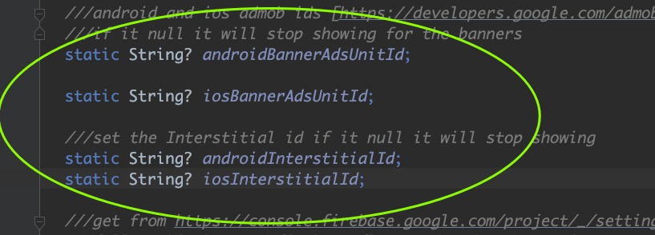

# Community FAQ

### How Users Register

- Users register with `email` and `password`.
- Required fields: `email`, `password`, `name`. Optional: `bio`, `image`.
- We collect device metadata and approximate location from IP for security/anti‑abuse.
- Password reset is via email OTP.

### iOS run bug

If you face this
`error building IOS. What should I do if I have the following problem? [Failed to install the app on the device.Domain: The parent bundle has the same identifier]`

- This comes from the ShareExtension. In Xcode, select `ShareExtension` target and update its bundle id to match your
  main bundle id with `.ShareExtension` suffix.
- For more info, check: [share_handler](https://github.com/ShoutSocial/share_handler)
  

### New features

- The app targets broad use cases. If you need custom features for your business, see Support for tailored work.

### Stop ads

- Update ad settings from the admin panel, or set the flags in config as shown below.
  

### Is there a Phone OTP version of the app?

Yes! SuperUp is available in **two authentication variants**:

| Version               | Location                     | Auth Method          |
|-----------------------|------------------------------|----------------------|
| **Email Version**     | `apps/super_up_app`          | Email + Password     |
| **Phone OTP Version** | `apps/super_up_app_firebase` | Phone + Firebase OTP |

**Email Version** (Default):

- Users register with email and password
- Email verification and password reset supported
- No Firebase dependency for authentication
- Best for avoiding vendor lock-in

**Phone OTP Version** (Firebase):

- Users register with phone number only
- OTP sent via Firebase Authentication SMS
- Requires Firebase project with Phone Auth enabled
- Configure `google-services.json` (Android) and `GoogleService-Info.plist` (iOS)
- Best for markets where phone-based auth is preferred

To build the Phone OTP version: see inside the source code you downloaded from codecanyou

```bash
cd super_up_app_otp
flutter build apk --release
```

### Why not WebRTC for calls

- WebRTC requires expensive TURN/SFU infra and global distribution to maintain quality. Agora.io provides reliable,
  scalable calls with a free quota and lower operational overhead, so it’s used instead.

### Call notifications

- Currently call notifications arrive like chat notifications. Full‑screen native call UI is being improved in upcoming
  updates.

### Admin panel

- Admin panel will keep receiving user management improvements in updates.

### Report bugs or request features

- You can submit any bug reports or improvement suggestions for the next version of the app
  at [GitHub Issues](https://github.com/super-up/bugs-improvements/issues). We will follow up with you there.

### Desktop voice recorder

- Desktop voice recording is disabled due to package limitations; will be revisited in future updates.

### Bug while releasing Android (Your project requires a newer version of Kotlin)

- Fixed in recent releases. Configure Android release signing properly.
- Create `key.properties` with your keystore info:

```
storePassword=your storePassword
keyPassword=your keyPassword
keyAlias=your keyAlias
storeFile=/Users/hatemragap/super-up-keystore.jks
```

- If you are not publishing to Play right now, you can temporarily sign with debug keys. In `android/app/build.gradle`,
  replace release signing section per Flutter docs with:

```
    signingConfigs {
        release {
            keyAlias keystoreProperties['keyAlias']
            keyPassword keystoreProperties['keyPassword']
            storeFile keystoreProperties['storeFile'] ? file(keystoreProperties['storeFile']) : null
            storePassword keystoreProperties['storePassword']
        }
    }
    buildTypes {
        release {
            signingConfig signingConfigs.release
        }
    }
```

to Delete the `signingConfigs{}`

```
  buildTypes {
        release {
            // TODO: Add your own signing config for the release build.
            // Signing with the debug keys for now, so `flutter run --release` works.
            signingConfig signingConfigs.debug
        }
    }
```

### Flutter state management

- Custom state management based on `ValueNotifier` and streams is used across the app.

### Plan support requirements

1. Firebase project (invite `hatemragapdev@gmail.com` temporarily for setup)
2. VPS with AVX support (2 vCPU, 2 GB RAM min, 100 GB SSD recommended)
3. Domain name pointed to the VPS (wildcard optional). SSL will be configured (Let’s Encrypt).
4. Agora.io account with 10$ billing (optional) can be done later
5. Google Maps api key with place search enabled; it will require enable billing (optional) can be done later
6. Google Ads banner IDs for Android and iOS (optional)
7. App name, logo, and support email
8. SMTP credentials for password reset (EMAIL_HOST, EMAIL_USER, EMAIL_PASSWORD)
9. Backend can be deployed with CapRover or standard VPS (see Deployment doc)
10. If publishing, add `hatemragapdev@gmail.com` to Play/App Store as needed during setup
11. Support applies to one product per purchase; additional products require separate plans
