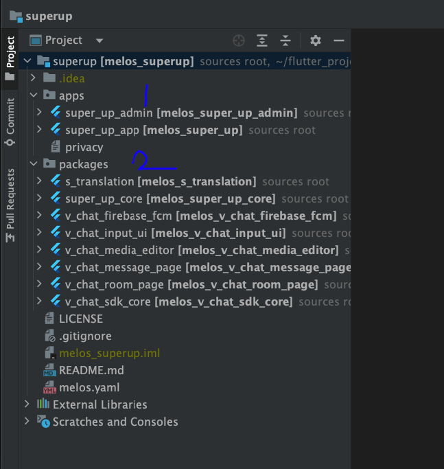

# Flutter

- project structure in split packages
- To run the project first activate `melos`

```
dart pub global activate melos
```

-then run this commend in the root of the project

```
melos bs
```

- this code will run pub get for you in all packages
  
- we have the following
- apps (`super_up_admin`) this is the admin panel
- apps (`super_up_app`) this app you should run it
- packages all needed packages the most important packages is the `super_up_core` the `s_constants.dart` in
  the `lib/src`

### Change app name,package,logo

- this step should be done first before connect firebase
- we will use this package [rename](https://pub.dev/packages/rename)
- install by `flutter pub global activate rename`
- to change package name `flutter pub global run rename --bundleId com.vchatsdk.vnotestarter`
  Example => `pub global run rename --bundleId com.XXXXXXX.XXXXXX`
- to rename the app use `flutter pub global run rename --appname "YOUR APP NAME"`

### Connect firebase

[android](https://firebase.google.com/docs/flutter/setup?platform=android),[ios](https://firebase.google.com/docs/flutter/setup?platform=ios)

- You can connect it easly be firebase
  CLI [tool](https://firebase.google.com/docs/flutter/setup?platform=ios#install-cli-tools)

### SConstants

- This file inside packages in [super_up_core] in `lib/src/s_constants.dart`
- This file contains the configuration of the app

```dart
abstract class SConstants {
  ///your super up base domain url
  ///like this (example.com) not start https// or any sub domains example [superupdev.com]
  static const _productionBaseUrl = "superupdev.online";

  ///your app name
  static const appName = "Superup";

  ///android and ios admob ids [https://developers.google.com/admob/flutter/quick-start] [https://developers.google.com/ad-manager/mobile-ads-sdk/flutter/quick-start]
  static const androidAdUnitId = "ca-app-pub-3940256099942544/6300978111";
  static const iosAdUnitId = "ca-app-pub-3940256099942544/2934735716";

  ///setup video and voice calls [https://agora.io]
  static const agoraAppId = "------------------------";

  ///change this to your google maps api key to enable google maps location picker
  static const googleMapsApiKey = "AIzaSyAP---------------------";

  ///update this url to share the app for others
  static const googlePlayUrl =
      "https://play.google.com/store/apps/details?id=com.app.superup";
  static const appleStoreUrl = "https://testflight.apple.com/join/F4tAbW5J";

  ///get the onesignal id for push notifications [https://onesignal.com]
  static const oneSignalAppId = "********-****-****-****-**************";

  ///don't update
  static String get feedUrl => "https://$_productionBaseUrl/apps/appcast.xml";

  ///don't update
  static String get baseMediaUrl {
    return "https://api.$_productionBaseUrl/";
  }

  ///don't update
  static Uri get sApiBaseUrl {
    return Uri.parse("https://api.$_productionBaseUrl/api/v1");
  }
}
```

### Add more language

- You can add new language by just open the [s_translation] package
- And inside `lib/i18n` create new file its name should follow the
- Standard of `intl_short language code.arb`.arb
- Inside this file copy the `intl_en.arb` and translate only the values and dont touch the key of the map
- Then, while you run the app, the new language will be added, and it will appears in the selections

### Ads

- get the ids from these urls get banner id for ios and android
- android and ios admob
  ids [quick-start](https://developers.google.com/admob/flutter/quick-start)  [mobile-ads-sdk](https://developers.google.com/ad-manager/mobile-ads-sdk/flutter/quick-start)
- dont forget to update the android `android/app/src/main/AndroidManifest.xml`

- `APPLICATION_ID` not unit id be `careful`

```xml

<meta-data
        android:name="com.google.android.gms.ads.APPLICATION_ID"
        android:value="ca-app-pub-YOUR KEY HERE!"/>
```

- put your android appId for ads here `android:value=`
- for Ios update the `ios/Runner/Info.plist`
- ```
  <key>GADApplicationIdentifier</key>
  <string>ca-app-pub-YOUR KEY HERE!</string>
  ```

### Agora.io

- Create agora app and enable it cupy the `appId` and
- Setup video and voice calls [agora](https://agora.io)
  `Static const agoraAppId = "------------------------";`

### Google api key

- Get google api [key](https://developers.google.com/admob/flutter/quick-start) and enable all options like `search`
  and `GEO` locations for android and ios
- Don't forget to update the android `android/app/src/main/AndroidManifest.xml`

```xml

<meta-data
        android:name="com.google.android.geo.API_KEY"
        android:value="YOUR API_KEY HERE!"/>
```

- and for ios
- `ios/Runner/AppDelegate.swift`
- GMSServices.provideAPIKey(`YOUR API_KEY HERE!`)

### About cupertino theme

- iam use `CupertinoApp` this means any material components will not work
- like (TextFiled, FloatingAction, ListTile,Card,Theme.of(),etc...) will throw exception you need to replace it by
  cupertino widgets
- TextFiled => CupertinoTextFiled, ListTile => CupertinoListTile ,Theme.of() =>CupertinoTheme.of() ,etc...
- more details [here](https://docs.flutter.dev/ui/widgets/cupertino)

### Notifications (ios)
APNs Integration (IMPORTANT):
Firebase Cloud Messaging uses Apple Push Notification Service (APNs) to send messages to iOS devices. Therefore, you will need to:

Create an APNs key in the Apple Developer Center.
Upload this key to the Firebase console in the Cloud Messaging settings for your project.
Configure the APNs key in your app by setting up your app's capabilities in Xcode. This includes enabling "Push Notifications" under "Capabilities".
Once you've done all this, your Flutter app on iOS should be able to receive notifications through Firebase!


### publish 
- open terminal inside the `super_up_app` folder
1. for android, you can run `flutter build apk --split-per-abi` for store [publish](https://docs.flutter.dev/deployment/android)
2. for web, you can run `flutter build web --web-renderer html`
3. for ios, you can run [ios](https://docs.flutter.dev/deployment/ios)


:::danger
Doesn't update any package version unless you know what to do
:::

