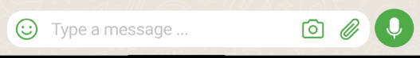
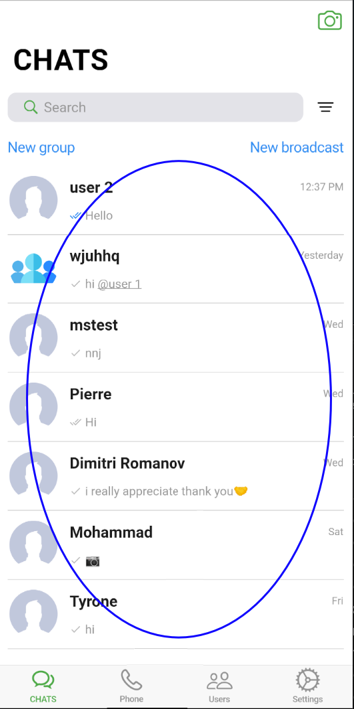
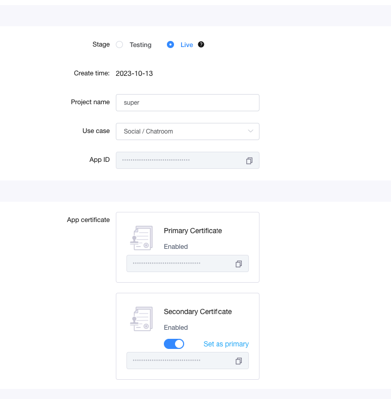
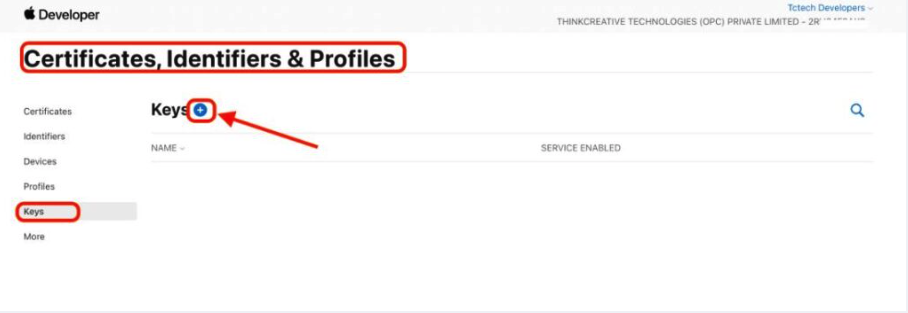
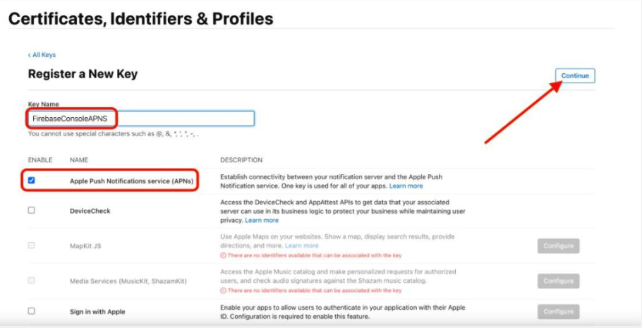
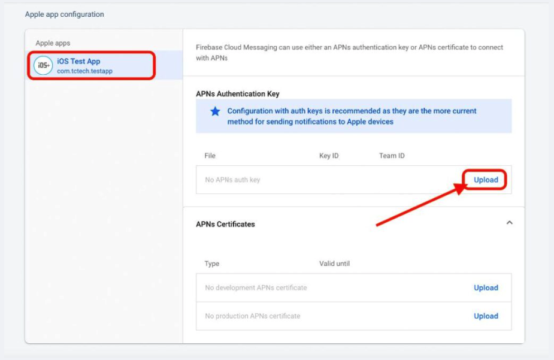

# Flutter

---

- project structure in split packages
- To run the project first activate `melos`

```
dart pub global activate melos
```

- Then run this commend in the root of the project

```
melos bs
```

- this code will run pub get for you in all packages
  
- we have the following
- admin (`super_dashboard`) this is the admin panel build by react.js
- apps (`super_up_app`) this app you should run it
- packages all needed packages the most important packages is the `super_up_core` the `s_constants.dart` in
  the `lib/src`

### Lest explain packages

1. `s_translate` contains all arb files for `super_up_app`,`super_dashboard` projects
2. `super_up_core` contains all logic for super up app itself like shared http requests,utils,widgets (DONT UPDATE)
3. `v_chat_firebase` contains the firebase FCM only logic (DONT UPDATE)
4. `v_chat_input_ui` this contains the ui and logic for the message input (recorder,file selector,location picker)
   

5. `v_chat_media_editor` this contains the ui of media editor
   
6. `v_chat_message_page` this contains the `ui & logic` of message page
   
7. `v_chat_room_page` this contains the `ui & logic` of chat page
   
8. `v_chat_sdk_core` contains all logic for v_chat app itself like shared http requests, socket,notifications (DONT
   UPDATE)

### Change app name,package,logo

- each app must have `unique` package name so you must change it! to be accepted in the stores
- this step should be done first before connect firebase
- we will use this package [rename](https://pub.dev/packages/rename)
- install by `flutter pub global activate rename`
- to change package name `flutter pub global run rename --bundleId com.vchatsdk.vnotestarter`
  Example => `pub global run rename --bundleId com.XXXXXXX.XXXXXX`
- to rename the app use `flutter pub global run rename --appname "YOUR APP NAME"`
- to update logo just update the `logo.png` in assets folder the logo must be `.png`
- then run the code in the super_up_app `flutter pub run flutter_launcher_icons:main`
- then this command `dart run flutter_native_splash:create`

### Full environment setup (Android/iOS/Web/macOS/Windows)

#### Prerequisites

- Flutter SDK 3.38.x+ (or as stated in `intro.md`) with `flutter doctor` all green
- Android Studio with Android SDK platforms 34+, NDK, and platform tools
- Xcode (for iOS/macOS) with command-line tools, CocoaPods `sudo gem install cocoapods`
- Melos installed and bootstrapped as above

#### Android setup

1. Create signing key (for Play release):

```bash
keytool -genkey -v -keystore ~/superup.keystore -alias superup -keyalg RSA -keysize 2048 -validity 10000
```

2. Place keystore at `apps/super_up_app/android/app/superup.keystore`.

3. Create `apps/super_up_app/android/key.properties`:

```properties
storePassword=CHANGE_ME
keyPassword=CHANGE_ME
keyAlias=superup
storeFile=superup.keystore
```

4. Build:

```bash
flutter build apk --split-per-abi
flutter build appbundle
```

#### iOS setup

- Update bundle identifier via the `rename` tool as described
- Open `ios/Runner.xcworkspace` in Xcode, set signing team, automatic signing
- Update `Info.plist` for AdMob Google Ads App ID and any permissions (camera, mic, location)
- Build:

```bash
flutter build ipa --export-options-plist=ExportOptions.plist
```

#### Web setup

- For best compatibility use HTML renderer:

```bash
flutter build web --release --web-renderer html
```

#### macOS/Windows

```bash
flutter config --enable-macos-desktop --enable-windows-desktop
flutter build macos
flutter build windows
```

### Connect firebase

- Recommend to user firebase flutter CLI which its new tool to make the firebase base connect straightforward
- [android](https://firebase.google.com/docs/flutter/setup?platform=android)
- [ios](https://firebase.google.com/docs/flutter/setup?platform=ios)
- You can connect it easily be firebase follow up this [video](https://www.youtube.com/watch?v=G-mbqiE87Lw)
- CLI [tool](https://firebase.google.com/docs/flutter/setup?platform=ios#install-cli-tools)

#### Firebase configuration details

- Android: ensure `google-services.json` in `android/app/`
- iOS: ensure `GoogleService-Info.plist` in `ios/Runner/`
- Add Firebase Messaging to receive pushes; on iOS enable Push + Background Modes
- If using APNs key, complete steps in Notifications section below

### SConstants

- This file inside packages in [super_up_core] in `lib/src/s_constants.dart`
- This file contains the configuration of the app

```dart
abstract class SConstants {
  ///your super up base domain url
  ///like this (example.com) not start https// or any sub domains example [superupdev.com] or server ip with port like [12.xxx.xxx:80]
  /// case of you use server ip just put the server ip connected to the port [http://ip:port]
  static const _productionBaseUrl = "superupdev.online";

  ///your app name
  static const appName = "Superup";

  ///android and ios admob ids [https://developers.google.com/admob/flutter/quick-start] [https://developers.google.com/ad-manager/mobile-ads-sdk/flutter/quick-start]
  static const androidAdUnitId = "ca-app-pub-3940256099942544/6300978111";
  static const iosAdUnitId = "ca-app-pub-3940256099942544/2934735716";

  ///setup video and voice calls [https://agora.io]
  static const agoraAppId = "------------------------";

  ///change this to your google maps api key to enable google maps location picker
  static const googleMapsApiKey = "AIzaSyAP---------------------";

  ///update this url to share the app for others
  static const googlePlayUrl =
      "https://play.google.com/store/apps/details?id=com.app.superup";
  static const appleStoreUrl = "https://testflight.apple.com/join/F4tAbW5J";

  ///get the onesignal id for push notifications [https://onesignal.com]
  static const oneSignalAppId = "********-****-****-****-**************";

  ///don't update update only if you use server ip just return your server ip with port [12.xxx.xxx:80/]
  static String get baseMediaUrl {
    ///if you dont setup domain yet you can return the server ip like this [return Uri.parse("http://ip:port/");]
    return "https://api.$_productionBaseUrl/";
  }

  ///don't update update only if you use server ip just return your server ip with port [12.xxx.xxx:80/api/v1]
  static Uri get sApiBaseUrl {
    ///if you dont setup domain yet you can return the server ip like this [return Uri.parse("http://ip:port/api/v1");]
    return Uri.parse("https://api.$_productionBaseUrl/api/v1");
  }
}
```

#### CORS/Domain considerations

- Set `_productionBaseUrl` to your apex domain, e.g., `example.com`
- Backend must be available on `https://api.example.com`
- If testing via IP/port, temporarily set `baseMediaUrl` and `sApiBaseUrl` to `http://IP:PORT/` and
  `http://IP:PORT/api/v1`

### Add more language

- You can add new language by just open the [s_translation] package
- And inside `lib/i18n` create new file its name should follow the
- Standard of `intl_short language code.arb`.arb
- Inside this file copy the `intl_en.arb` and translate only the values and dont touch the key of the map
- Then, while you run the app, the new language will be added, and it will appears in the selections

### Ads

- get the ids from these urls get banner id for ios and android
- android and ios admob
  ids [quick-start](https://developers.google.com/admob/flutter/quick-start) [mobile-ads-sdk](https://developers.google.com/ad-manager/mobile-ads-sdk/flutter/quick-start)
- dont forget to update the android add the ads app Id `android/app/src/main/AndroidManifest.xml`
- and for ios open `ios/Runder/info.plist` update the
  ```
  		<key>GADApplicationIdentifier</key>
  	<string>Your app id</string>
  ```
- `APPLICATION_ID` not unit id be `careful`

```xml

<meta-data
        android:name="com.google.android.gms.ads.APPLICATION_ID"
        android:value="ca-app-pub-YOUR KEY HERE!"/>
```

- put your android appId for ads here `android:value=`
- for Ios update the `ios/Runner/Info.plist`
- ```
  <key>GADApplicationIdentifier</key>
  <string>ca-app-pub-YOUR KEY HERE!</string>
  ```

### Agora.io

- Create agora app and enable it copy the `appId` and enable
- Setup video and voice calls [agora](https://agora.io)
  `Static const agoraAppId = "------------------------";`
  
- enable the `Secondary Certificate`

### Google api key

- Get google api [key](https://developers.google.com/admob/flutter/quick-start) and enable all options like `search`
  and `GEO` locations for android and ios
- Don't forget to update the android `android/app/src/main/AndroidManifest.xml`

```xml

<meta-data
        android:name="com.google.android.geo.API_KEY"
        android:value="YOUR API_KEY HERE!"/>
```

- and for ios
- `ios/Runner/AppDelegate.swift`
- GMSServices.provideAPIKey(`YOUR API_KEY HERE!`)

### Notifications iOS (APNS) AND VOIP

- Login to your Apple Developer Account,(if you don’t have, you need to create one to be able to test, publish ios app).

- Navigate to `Certificates, Identifiers & Profiles > Keys >` Add New from the left menu.



- Register a New key.
- Set the key name as `FirebaseAPNS`.
- Tick “Apple Push Notification Services (APNs)”
- Click Continue to register it.
- 
- Once the key is registered follow below steps:
- Copy the Team ID (keep it aside)
- Download the Auth key File (keep it aside)
- Copy the Key ID (keep it aside)
- Click “Done” to complete.
- 
- Open Firebase Dashboard > Project Settings
- 
- Click on “Cloud Messaging” tab. For the iOS app, click “Upload”.
- 
- Click on “Browse” to upload the recently downloaded Auth key file.
- Paste the Key ID
- Paste the Team ID
- Click upload to register it.
  
- **VOIP** ios setup This key you have downloaded you need to put the content of it to the backend code at the file
  `AuthKey.p8` it contains `XXXX` just replace all content with the new one you have
- All done now with ios `notifications`

#### iOS Background modes & capabilities

- Enable: Background fetch, Remote notifications, Audio/VoIP if using calls
- Add `Push Notifications` capability
- For VoIP, ensure backend token generation and incoming push payloads are correct

### how to update theme

- For `dark` theme use it already inside the `main.dart` just update it `dont delete it!`
- Of course you can update the theme direct from the code if you have much experience

#### First message page

```
darkTheme: ThemeData(
          extensions: [
            VMessageTheme.dark().copyWith(
            ///see  options!
            ),
          ],
        ),
```

- for `light` theme use

```
   theme: ThemeData(
            extensions: [
                 VMessageTheme.dark().copyWith(
                   ///see options!
            ),
            ],
          ),
```

#### second Chats Room page

- for `dark` theme use

```
darkTheme: ThemeData(
          extensions: [
            VRoomTheme.light().copyWith(
              ///see  options!

              ),
          ],
        ),
```

- for `light` theme use

```
   theme: ThemeData(
            extensions: [
            VRoomTheme.light().copyWith(
              ///see options!

              ),
            ],
          ),
```

### one signal

- Get the onesignal id for push notifications [https://onesignal.com] see flutter docs
- then in `apps/super_up_app/lib/v_chat_v2/v_chat_config.dart` enable OneSignal push by add this `constructor`
- don't forget to update the app id in `SConstants.oneSignalAppId`

```
      vPush: VPush(
        enableVForegroundNotification: true,
        vPushConfig: const VLocalNotificationPushConfig(),
        ///if you support fcm push notifications
        fcmProvider: VChatFcmProver(),
        ///if you support OneSignal push notifications **THIS**
        oneSignalProvider: VChatOneSignalProver(
          appId: SConstants.oneSignalAppId,
        ),
      ),
```

:::fin
If firebase is available into your country its recommended to use it
for notifications push which its 100% free service with no limits!
:::

### Admin panel

1. super up introduce admin panel to control the app
2. there are two types of login admin login and viewer login
3. you will have two passwords for the admin one for admin another for viewer
4. admin can do anything viewer can only see the data he cant edit it
5. you can set the password for admin and viewer from the `.env.production` file in the backend files this file is
   hidden
   `#Admin panel passwords be carfaul
ControlPanelAdminPassword= "xxxxxxxxxxxxx" # put strong password for admin who can edit and update any thing in the app
ControlPanelAdminPasswordViewer= "xxxxxxxxxx-xxxx" # put strong password for admin that can only read(see ,users data,chats data etc...) he cannot update any thing`
6. You can change it any tine you want to re deploy your app!

### publish

- open terminal inside the `super_up_app` folder

1. for android, you can run `flutter build apk --split-per-abi` for
   store [publish](https://docs.flutter.dev/deployment/android)
2. for web, you can run `flutter build web --web-renderer html` see backend section for how to upload
3. for ios, you can run [ios](https://docs.flutter.dev/deployment/ios)

#### Store readiness checklist

- Unique app name and bundle identifiers (Android package, iOS bundle id)
- App icons and splash (launcher icons, native splash)
- Privacy policy hosted at `https://api.<domain>/privacy-policy.html`
- Working push notifications (keys configured)
- Release signing (keystore and Apple certificates/profiles)
- Versioning and changelog

:::danger
Doesn't update any package version unless you know what to do
:::
