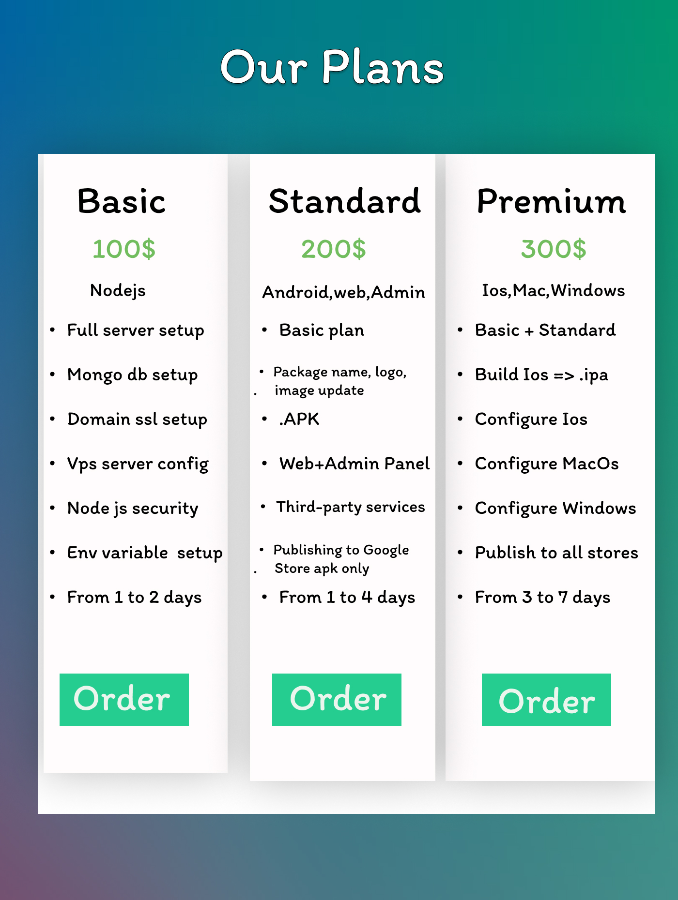

# Get Support

---

**Choose Your Perfect Plan for Super Up Chat App Deployment**

Welcome! Super Up is a full multi‑platform Flutter chat app. Choose a plan or request a custom quote.

### **Basic Plan - $100 (Node.js backend only)**

Ideal for beginners who want to set up the server side.

**Features:**

- Purchase your own `domain name` and `VPS server`.
- Complete server side configuration including:
  - MongoDB setup with security optimizations.
  - Free SSL certification installation for secure connections.
  - Full Node.js environment setup.
- **Delivery Time:** Ready within 3 to 5 days.

### **Standard Plan - $200 (Android, Web, Admin Panel)**

A step-up for those ready to launch their Android and Web presence.

**Features:**

- Everything from the Basic Plan.
- Flutter app configurations tailored to your brand:
  - Custom app package name, logo, and app name.
  - Compilation of the Android APK, Web Chat, and Admin Panel.
  - Integration of third-party services (Agora.io, Google Ads, Google Maps, Firebase).
- Assistance with publishing the app on the Google Play Console (_Google Developer Account fee of $25 not included_).
- **Delivery Time:** Ready within 7 to 10 days.

### **Premium Plan - $300 (Android, Web, Admin Panel, Windows, iOS, macOS)**

The full package for maximum reach across all platforms.

**Features:**

- Inclusive of all offerings in the Basic and Standard Plans.
- Brand customization extends to iOS, macOS, and Windows versions.
- Compilation and build for the .ipa and macOS app versions.
- Publishing support for iOS, macOS, and Windows (_Apple Developer Account fee of $100 and Microsoft Account fees not
  included_).
- I will manage future updates for you in this plan!
- **Delivery Time:** Ready within 10 to 15 days.

---

Absolutely, you can conclude your plans with an option for customization to meet specific business needs like this:

**Tailored solutions for your business**

In addition to the above plans, we also offer a **full app rebuild service** to fit the unique demands of your business.
Whether you require specific features, design changes, or unique integrations, we can craft a solution that aligns
perfectly with your vision.

- **Custom Rebuild:** Contact us with your requirements, and we will provide you with a bespoke quote.
- **Flexible Solutions:** We are committed to flexibility and will work closely with you to ensure that the final
  product meets your business objectives.

Reach out through Envato for a consultation and custom quote.

Let's create a chat app that's uniquely yours!

---

Adding this section provides a complete spectrum of services from standard plans to fully customized solutions, catering
to a wider range of customers and their varying needs.

**Additional information**

- **Support:** All plans come with basic installation support and guidance.
- **Customization:** Please provide all necessary branding materials upon purchase.
- **Accounts:** Costs associated with Google, Apple, and Microsoft developer accounts are not included in the plan
  prices.
- **Timeframe:** The indicated delivery times are from the start of the project.

## Let's launch your chat app together!

:::tip Contact
Contact: `hatemragapdev@gmail.com` • Envato • Skype `live:.cid.607250433850e3a6` • WhatsApp `+201026488379`
:::

:::tip Purchase_2
Purchase the app first from `CodeCanyon` and include your purchase key in your email to receive support.
:::

---
